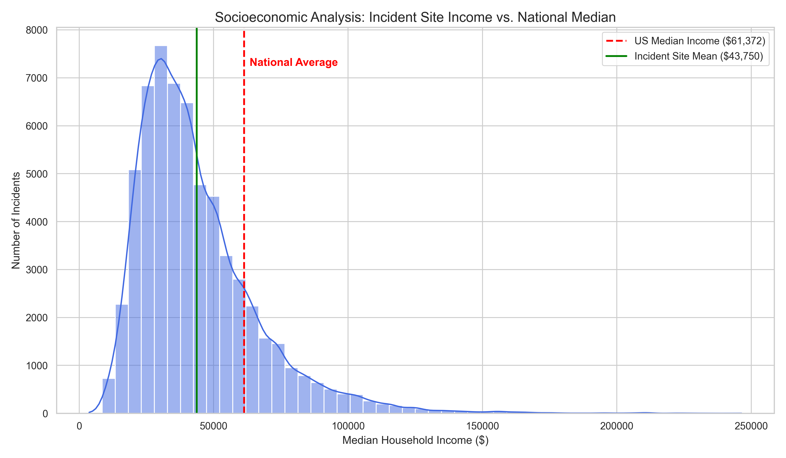

# Gun Violence vs. Median Household Income Analysis (2017)

A geospatial data science project analyzing the correlation between gun violence incident locations and local economic data in the United States.

---

## About

This project investigates the socioeconomic context of gun violence by mapping 2017 incident data to specific US Census Tracts. By performing a spatial join between incident coordinates (Latitude/Longitude) and Census Bureau TIGER/Line shapefiles, the analysis attaches 2017 American Community Survey (ACS) median household income data to each event.

**Key Objective:** To determine if gun violence incidents are disproportionately concentrated in lower-income areas.

---

## Tech Stack

* **Language:** Python 3.12
* **Data Analysis:** `pandas`
* **Geospatial Analysis:** `geopandas`, `shapely` (Spatial Joins, Coordinate Reference Systems)
* **Visualization:** `matplotlib`, `seaborn`, `folium` (Interactive HTML Mapping)
* **Web Scraping:** `BeautifulSoup4` (Automated Census data downloads)

---

## Initial Setup

1. **Clone the Repository:**

    ```bash
    git clone git@github.com:markr05/gun-violence-analysis.git
    cd gun-violence-analysis
    ```

2. **Create and Activate Virtual Environment:**

    ```bash
    python -m venv .venv
    source .venv/bin/activate
    ```

3. **Install Required Libraries:**

    ```bash
    pip install -r requirements.txt
    ```

---

## Running the Analysis

1. **Prepare Data:**

    `clean-gun-violence-data.csv` will already be in the data folder. If you want to recreate this file you must unzip the `gun-violence-data_01-2013_03-2018.csv.zip` file and run the dataset_cleanup.py file inside the src folder.
    The project uses the `ACSDT5Y2017.B19013-Data.csv` file for Census income statistics.

2. **Execute Analysis:**

    Make sure you are executing these commands inside the src folder.

    ```bash
    python final_analysis.py
    ```

3. **Process Overview:**

    * Converts raw CSV coordinates into a `GeoDataFrame`.
    * Downloads and extracts US Census Tract shapefiles for all 50 states.
    * Performs a spatial join (`sjoin`) to match incidents to 11-digit GEOIDs.
    * Calculates average median household income for various demographics and incident types.

---

## Key Results

My analysis revealed that the average household income in areas where shootings occurred in 2017 was approximately **$43,000**.

* **Context:** This is significantly lower than the national median household income at the time, highlighting a strong geographic correlation between lower economic status and incident frequency.
* **Visualization:** The project generates distribution plots (`income_distribution.png`) and interactive `map.html` files to visualize these "hotspots" geographically.

---
